# Tamagotchi P1 und P2 im Browser, mit Care-Bot

Das Original-Tamagotchi von 1996/97 (erste oder zweite Generation) läuft hier als emulierte ROM auf einem Server und wird im
Browser angezeigt, beliebig viele Tiere nebeneinander, jedes in seinem Tab. Ein Care-Bot drückt die drei Tasten, wenn das Tier etwas braucht, und kann
gezielt einen bestimmten Charakter großziehen.

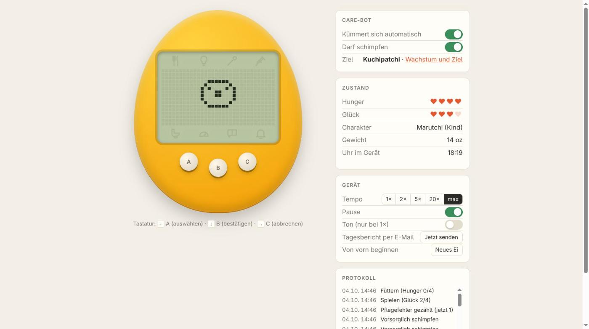

Die Emulation übernimmt [TamaLIB](https://github.com/jcrona/tamalib) von Jean-Christophe Rona.
Darum herum liegen eine dünne C-Hülle, ein Python-Server ohne weitere Abhängigkeiten und zwei
HTML-Seiten.

## Die ROM gehört nicht dazu

Die ROMs sind urheberrechtlich geschützt und liegen nicht in diesem Repository. Jedes Modell
braucht seine eigene:

| Modell | Datei | Größe | SHA-1 | CRC32 |
|---|---|---|---|---|
| Tamagotchi P1 | `tama.b` aus dem MAME-Romset `tama` | 12 288 Bytes | `4b4979cf92dc9d2fb6d7295a38f209f3da144f72` | `5c864cb1` |
| Tamagotchi P1 Japan | `TamagotchiP1J.bin` (Sammlung zu BrickEmuPy) | 12 288 Bytes | `15763f806c9c792f6a6458538dbd932a3c6668a3` | `15647a14` |
| Tamagotchi P2 | `tamag2.bin` aus dem MAME-Romset `tamag2` | 12 288 Bytes | `09e5101b37636a314fc599d5d69b4846721b3c88` | `9f97539e` |
| Tamagotchi Angel | `tamaang.bin` aus dem MAME-Romset `tamaang` | 16 384 Bytes | `f5899bb7717756ac581451cf16cf97d909961c5c` | `87bcb59f` |
| Tamagotchi Morino | `TamagotchiMorino.bin` (Sammlung zu BrickEmuPy) | 16 384 Bytes | `4b578ea5dd328fd49fc7a664abeca79e35d573b2` | `647ea772` |
| Tamagotchi Umino | `TamagotchiUmino.bin` (Sammlung zu BrickEmuPy) | 16 384 Bytes | `69d916819f8f4aa4be9194e6c78f099bf8199f37` | `baae4199` |

Ist beim Start keine ROM da, zeigt der Server statt des Tamagotchis die Seite „Optionen“ und
fragt danach: Man lädt die Datei (oder das ZIP des Romsets) im Browser hoch oder nennt den Pfad,
unter dem sie auf dem Server liegt. Angenommen wird sie nur, wenn die Prüfsumme passt.
Gespeichert wird sie im Ordner `roms/` neben den Spielständen. Wer ROMs selbst hinlegen will:
dorthin, als `tama.b` neben den Spielstand, nach `tama/tama.b`, oder mit `--rom` eine Datei oder
einen ganzen Ordner angeben (mehrfach möglich).

## Mehrere Tiere

Oben auf der Seite steht für jedes Tier ein Tab, „+“ legt ein neues an (Modell wählen, Name
vergeben, Farbe der Hülle aussuchen), auch mehrere vom selben Modell. Jedes Tier hat seinen
eigenen Care-Bot, sein Ziel, sein Tempo und seinen Spielstand; die Farbe lässt sich unter
„Gerät“ jederzeit ändern. „Tier entfernen“ schließt den Tab; der Spielstand wird dabei
nicht gelöscht, sondern nach `deleted/` verschoben.

Jedes Tier läuft in einem eigenen Prozess (TamaLIB hält die ganze Maschine in globalen
Variablen, in einen Prozess passt also nur eines). In Echtzeit braucht ein Tier etwa 1 % eines
Prozessorkerns und 25 MB.

Neben dem Spielstand des ersten Tiers (`tama_state.json`) liegen `pets.json` mit der Liste der
Tiere, `pets/` mit den weiteren Spielständen und `settings.json`. Wer von der Fassung mit nur
einem Tier kommt, findet es als ersten Tab wieder.


## Starten

```bash
python3 server.py            # baut libtama.so bei Bedarf, dann http://127.0.0.1:8137
```

Benötigt `gcc`, `make` und `python3`. Strg+C beendet und speichert den Spielstand in
`tama_state.json`. Mit Docker: `docker compose up -d --build`; Spielstand, ROM und
Einstellungen liegen dann im Volume unter `/data`. Die Compose-Datei veröffentlicht
keinen Port und erwartet ein externes Netz `httpd` für einen Reverse-Proxy; das ist an die
eigene Umgebung anzupassen. Die Oberfläche hat keine Anmeldung und gehört nicht ungeschützt ins
Internet.

Das Tier lebt im Server-Prozess und läuft weiter, wenn kein Browser offen ist. Das Tempo lässt
sich bis etwa 2600-fach hochdrehen.

Optional schickt der Server abends einen Tagesbericht per E-Mail. Der Mailserver wird auf der
Seite „Optionen“ (`/settings`) eingetragen und in `settings.json` neben dem Spielstand
gespeichert, das Passwort unverschlüsselt. Umgebungsvariablen (`.env.example`) dienen als
Vorgabe.

## Der Care-Bot

Der Bot liest Hunger, Glück, Häufchen und Krankheit aus dem RAM und dem Display und bedient dann
das Menü wie ein Mensch: A wählt das Icon, B bestätigt, C bricht ab. Er stellt außerdem die Uhr
des Geräts nach der Systemzeit.

Wer selbst eine Taste drückt oder ein Menü-Icon im Display anklickt (der Server läuft dann mit A
dorthin), hat das Gerät für sich: Der Bot bricht ab, was er gerade tut, und macht erst 60 Sekunden
nach der letzten Eingabe weiter.

Auf der Unterseite `/bot` lässt sich ein Ziel wählen. Der Bot macht dann genau die Fehler, die
für diesen Charakter nötig sind, und pflegt sonst fehlerfrei.

Am Ende eines Lebens bleibt das Gerät auf seinem letzten Bild stehen, bis jemand A und C zusammen
drückt: Dann erscheint ein neues Ei, die Uhr läuft weiter, und es schlüpft nach fünf Minuten von
selbst. Mit dem Schalter „Nach dem Ende neu beginnen“ (aus, solange man ihn nicht einschaltet)
macht das der Bot und zieht das nächste Tier mit demselben Ziel groß. Die ROM nimmt den
Doppeldruck nicht jedes Mal an; der Bot wiederholt ihn, bis das Ei da ist.

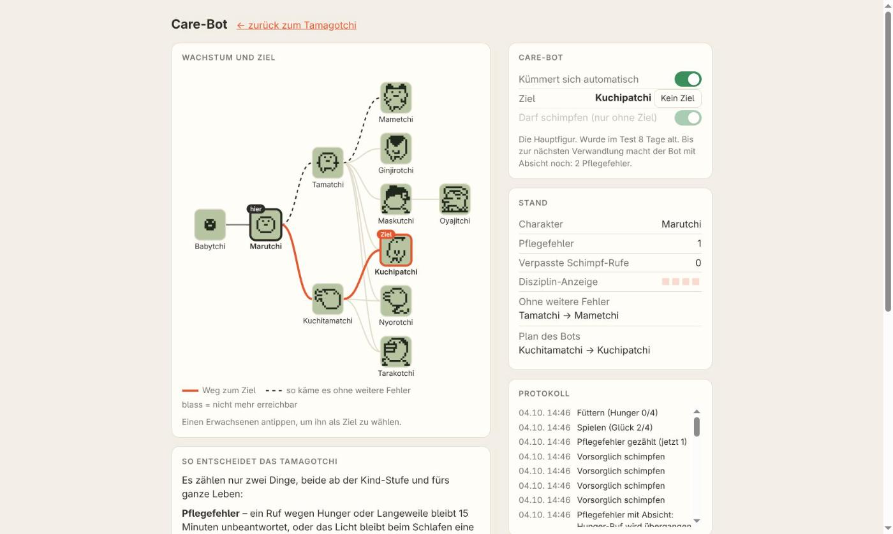

## Was den Charakter bestimmt

Die ROM zählt zwei Dinge, beide ab der Kind-Stufe, beide nur aufwärts bis 15 und für das ganze
Leben:

- **Pflegefehler** (RAM `0x42`): Ein Ruf wegen leerem Hunger oder leerem Glück bleibt etwa
  15 Minuten unbeantwortet, oder das Licht bleibt beim Schlafen 65 Minuten an.
- **Verpasste Schimpf-Rufe** (RAM `0x51`): Das Tier ruft, obwohl nichts fehlt, und wird etwa
  15 Minuten lang nicht geschimpft.

Die Disziplin-Anzeige im Status-Bild (RAM `0x43`) geht in die Entscheidung nicht ein.

| Verwandlung | Pflegefehler | verpasste Schimpf-Rufe | wird zu |
|---|---|---|---|
| Marutchi (Kind) | 0–2 | egal | Tamatchi |
| | ab 3 | egal | Kuchitamatchi |
| Tamatchi | 0–2 | 0 | Mametchi |
| | 0–2 | 1 | Ginjirotchi |
| | 0–2 | ab 2 | Maskutchi |
| | ab 3 | 0–1 | Kuchipatchi |
| | ab 3 | 2–3 | Nyorotchi |
| | ab 3 | ab 4 | Tarakotchi |
| Kuchitamatchi | egal | 0–1 | Kuchipatchi |
| | egal | 2 | Nyorotchi |
| | egal | ab 3 | Tarakotchi |

Hat schon das Kind drei oder mehr Schimpf-Rufe verpasst, entsteht eine zweite Art Teenager mit
anderen Grenzen (RAM `0x50`):

| Verwandlung | Pflegefehler | verpasste Schimpf-Rufe | wird zu |
|---|---|---|---|
| Tamatchi, zweite Art | 0–3 | ab 2 | Maskutchi, vier Tage später Oyajitchi |
| | ab 4 | bis 7 | Nyorotchi |
| | ab 4 | ab 8 | Tarakotchi |
| Kuchitamatchi, zweite Art | egal | bis 5 | Nyorotchi |
| | egal | ab 6 | Tarakotchi |

Die Geheimfigur Oyajitchi entsteht nur aus diesem Maskutchi. Ob danach geschimpft wird, ändert
daran nichts.

Diese Tabellen stammen nicht aus dem Netz, sondern aus der ROM: Kurz vor jeder Verwandlung
wurden beide Zähler im emulierten RAM auf alle 16 × 16 Kombinationen gesetzt und das Ergebnis
ausgelesen. Die Skripte dazu liegen in [`lab/`](lab/). Getestet sind nur diese drei ROM-Dumps;
andere Fassungen und die Neuauflagen können anders rechnen.

### Tamagotchi P1 Japan

Die japanische Ausgabe ergab dieselben Tabellen und hat dasselbe Spiel. Anders ist nur das Ende:
statt des Engels erscheint ein Grabstein.

### Tamagotchi Morino

Das Morino (Mori de Hakken! Tamagotch, das mit den Käfern) ist dieselbe Maschine wie die anderen:
Uhr, Hunger, Glück, Gewicht, Häufchen und Figur liegen in denselben RAM-Zellen. Anders ist fast
alles, was über das Wachstum entscheidet:

- **Zwei Eier:** Nach dem Uhrstellen wartet das Gerät auf eine Wahl. A oder C wechselt zwischen
  dem weißen Ei (Babymotchi, zwölf mögliche Erwachsene) und dem gefleckten (Imotchi, wird immer
  Kabutotchi), B zeigt die Uhr, ein weiteres B beginnt. Der Bot nimmt das weiße, außer das Ziel
  heißt Kabutotchi.
- **Keine Pflegefehler, keine Krankheit:** Es stirbt nur an Hunger, an Verletzungen oder im Kokon.
- **Fressfeinde:** Zur vollen Stunde kommt ab und zu ein Fuß oder ein Frosch. Das fünfte Icon
  leuchtet dann; es lässt sich sonst nicht anwählen. Eine Taste zeigt den Angreifer, Klopfen
  vertreibt ihn (zwei Glücksherzen). Sonst ist das Tier verletzt und braucht Medizin; ein zweiter
  Treffer im verletzten Zustand tötet es.
- **Spiel:** Unter einem von vier Hüten liegt ein Blatt, viermal hintereinander. RAM `0x80` verrät
  den Hut (dieser und der nächste gewinnen), der Bot trifft deshalb immer. Jedes Spiel kostet 1 mg.
- **Kokon:** Imotchi wird alle zwölf wachen Stunden gewogen und spinnt ab 40 mg einen Kokon. Dessen
  Art hängt an der versteckten Freundschaft (+2 je Spiel, −1 je verlorenem Glücksherz), der
  Erwachsene an der Temperatur am Ende der 24 Stunden. Der Bot steuert Gewicht, Freundschaft und
  Temperatur auf das gewählte Ziel hin; die Regeltabelle steht auf `/bot`.

| Kokon | entsteht bei | Temperatur am Ende | wird zu |
|---|---|---|---|
| A | 1. oder 2. Wiegen, Freundschaft ab 10 | 1–6 | Tentotchi |
| | | 7–9 | wieder Imotchi |
| | | 10–14 | Koganetchi (Twinaritchi, wenn die Süße durch 4 geteilt den Rest 3 lässt) |
| B | 1. oder 2. Wiegen mit Freundschaft 7–9, 3. Wiegen ab 7 | 1–7 | Minotchi |
| | | 8–14 | Chobitamatchi |
| C | 1. bis 3. Wiegen, Freundschaft bis 6 | 1–7 | Gejitchi |
| | | 8–14 | Mushibatchi |
| D | 4. Wiegen, egal wie schwer | 4–12 | Funkorogatchi |
| | | 1–3, 13–14 | Minotchi |
| gefleckt | geflecktes Ei, ab 40 mg | 1–14 | Kabutotchi |

Bei Temperatur 0 oder 15 stirbt der Kokon. Helmetchi schlüpft aus Kokon D, wenn die Imotchi vorher
schon einmal aus Kokon A zurückgekommen ist. Die Temperatur ändert sich etwa alle zweieinhalb
Stunden um 1 oder 2; für das schmale Fenster 7–9 kann der letzte Schritt danebengehen, Helmetchi
gelingt deshalb nicht in jedem Anlauf.

### Tamagotchi Umino

Das Umino (Umi de Hakken! Tamagotch, außerhalb Japans Tamagotchi Ocean) ist ein eigenes Programm:
Keine RAM-Zelle liegt dort, wo die anderen sie haben, deshalb hat es einen eigenen Bot
(`carebot_umino.py`). Es gilt als das schwerste der Reihe, und das liegt an vier Dingen:

- **Wasser statt Häufchen:** Etwa alle zwei Stunden kommt ein Totenkopf auf der Statusseite dazu,
  bei vier ist der Bildschirm schwarz. Jedes Wasserwechseln nimmt einen weg.
- **Fressfeind:** Ein Eisbär legt sich neben das dösende Tier. Eine Taste weckt es und er geht;
  sonst ist es verletzt und braucht Medizin. Der Bot drückt A. Die Rufbox täte es auch, zählt
  dabei aber als Schimpfen.
- **Krake:** In etwa jedem zwölften Spiel bricht ein Krake herein, schwärzt das Wasser und nimmt
  alle Glücksherzen. Dagegen hilft nichts.
- **Krankheit:** Jeder Snack erhöht einen versteckten Zähler um 2 bis 6, nach 255 beginnt er
  wieder bei 0. Alle zweieinhalb Stunden entscheidet sein Stand, ob das Tier krank wird; nahe 0
  bleibt es gesund. Vier Krankheiten als dieselbe Figur sind tödlich. Der Bot füttert deshalb
  nach jeder Verwandlung so lange Snacks, bis der Zähler wieder unter 10 steht.

Im Spiel gewinnt, wer im richtigen Moment drückt, und der Moment steht in RAM `0x92`. Drei gewonnene Runden füllen ein Herz, jedes Spiel kostet 1 g.

Über die Figur entscheiden zwei Zähler, die bei jeder Verwandlung wieder bei 0 beginnen:
**Pflegefehler** (eine Herzreihe ist leer und bleibt es, je nach Lage alle 20 bis 45 Minuten einer) und
**verpasste Rufe** (es ruft, obwohl nichts fehlt, und will mit der Rufbox geschimpft werden; bis
dahin nimmt es weder Futter noch Spiel an). Dazu kommen Gewicht und Wasser im Moment der
Verwandlung.

| Verwandlung | Pflegefehler | verpasste Rufe | wird zu |
|---|---|---|---|
| Kuragetchi | egal | 0–1 | Otototchi |
| | egal | ab 2 | Kingyotchi |
| Otototchi | 0 | 0 | Keropyontchi |
| | 0 | ab 1 | Taiyakitchi |
| | 1–3 | 0–1 | Taiyakitchi |
| | 1–3 | ab 2 | Kaitchi |
| | ab 4 | egal | Kaitchi |
| Kingyotchi | 0–3 | 0–3 | Taiyakitchi |
| | ab 4, oder | ab 4 | Kaitchi |
| Otototchi oder Kingyotchi | egal | egal | Kujiratchi, wenn es 99 g wiegt |
| Kingyotchi | egal | egal | Ashigyotchi, wenn das Wasser schwarz ist |
| Kaitchi | egal | 0 | Ningyotchi, wenn es genau 10 g wiegt |

Ningyotchi, die Meerjungfrau, ist die Geheimfigur. Der Bot geht dafür über Otototchi und macht
dort vier Pflegefehler, statt wie in den Anleitungen Rufe zu übergehen: Ein übergangener Ruf
dauert zwischen einer Viertelstunde und zwei Stunden, und so lange frisst das Tier nicht. Als
Kaitchi beantwortet er jeden Ruf und spielt das Gewicht auf 10 g herunter. Alles ist im Emulator
nachgemessen und deckt sich mit dem Care Sheet von Gotchi Garden.

Um 5:05 Uhr morgens schwimmt eine Minute lang ein Karpfenwimpel durchs Bild (Koinoboritchi),
wenn in der Zeit keine Taste gedrückt wird. Der Bot lässt die Tasten so lange los.

### Tamagotchi Angel

Der Angel (Tenshitchi no Tamagotchi, hier die japanische Fassung) hat einen ersten Care-Bot.
Darunter steckt dieselbe Maschine wie im P1: Figur, Hunger, Glück, Pflegefehler, Uhr und Licht
liegen in denselben RAM-Zellen, statt des Gewichts wird Angel Power gezählt. Anders sind die
Reihenfolge im Menü (Status, Essen, Spiel, Toilette, Loben, Medizin, Licht), das Spiel und ein
paar Eigenheiten:

- **Sprungspiel:** Fünfmal kommt ein Hindernis. Der Bot liest dessen Position aus dem RAM und
  springt (B), wenn es zwei Schritte entfernt ist. Ein Spiel füllt das Glück ganz.
- **Süßes und Fledermaus:** Süßes gibt 2 Angel Power. Etwa bei jedem sechsten kommt eine
  Fledermaus; ein Klopfen aufs Gehäuse, solange sie im Bild ist, rettet es. Unter dem Gerät gibt
  es dafür die Taste „Klopfen“ (Taste T), der Bot klopft selbst.
- **Medizin:** Ein krankes Tier brauchte im Test vier Gaben.
- **Beten:** Ab der Kind-Stufe steht das Tier ab und zu mit erhobenen Armen in der Bildmitte. Der
  Bot lobt es dann; das gibt 20 Angel Power. Danach liegt immer ein Häufchen da.
- **Spaziergang:** Ab und zu zeigt das Bild eine Tür und das Tier ist fünf Minuten weg. Der
  Bot wartet, bis es zurückkommt.
- **Pflegefehler** werden bei jeder Verwandlung wieder auf 0 gesetzt.

Auf `/bot` lässt sich auch beim Angel ein Ziel wählen. Jede Stufe entscheidet für sich, die
Pflegefehler beginnen bei jeder Verwandlung wieder bei 0:

| Verwandlung | Pflegefehler | Angel Power | wird zu |
|---|---|---|---|
| Marutchi Angel (Kind) | 0–2 | egal | Tamatchi Angel |
| | ab 3 | egal | Takotchi Angel |
| Tamatchi Angel | 0–2 | egal | Chestnut Angel |
| | ab 3 | egal | Ginjirotchi Angel |
| Takotchi Angel | egal | ab 40 | Chubby Angel |
| | egal | 30–39 | Tarakotchi Angel |
| | egal | unter 30 | Oyajitchi Angel |
| Chestnut Angel | 0–3 | egal | Twin Angels |
| Chubby Angel | 0–2 | egal | Twin Angels |
| Tarakotchi Angel | 0–3 | egal | Cactus Angel |
| Oyajitchi Angel | 0–4 | egal | Shogun Angel |

Mit mehr Fehlern bleiben die vier Erwachsenen der letzten Zeilen, was sie sind; Ginjirotchi Angel
verwandelt sich nie weiter. Wird ein Angel als dieselbe Figur dreimal krank, wird er zu
Deviltchi und ist verloren (krank wird er, wenn man im Wachen das Licht ausschaltet). Alle Grenzen
sind im Emulator nachgemessen (`growth_angel.py`) und decken sich mit der Figurenliste des
[Tamagotchi-Wikis](https://tamagotchi.fandom.com/wiki/Tamagotchi_Angel/Character_list).

Für ein Ziel macht der Bot die nötigen Pflegefehler selbst: Jedes Loben nimmt ein Herz Einsatz,
ist keins mehr da, ruft das Tier, und ein Ruf, der eine Viertelstunde unbeantwortet bleibt, zählt
(etwa ein Fehler pro Stunde). Beim Takotchi Angel hält er die Angel Power im passenden Bereich:
Süßes hebt sie, und wo sie niedrig bleiben muss, lobt er das Beten nicht. Im Zeitraffer hat er
vom Start weg jedes der zehn Ziele erreicht.

**Lucky Unchi-Kun** braucht vier Generationen nacheinander auf demselben Gerät (gefunden vom
YouTuber Aibonnotamakatsunikki, hier im Emulator bestätigt): zweimal einen Oyajitchi Angel, der
einer bleibt, bis er sich verabschiedet (der zweite geht als Unchi-Kun ohne Gesicht), dann einen
Ginjirotchi Angel; das Baby der vierten Generation wird kein Kind, sondern nach fünf Tagen Lucky
Unchi-Kun. Der Bot macht das als Ziel von allein: Er lässt jeden Erwachsenen zwei Tage leben,
macht dann alle zwölf Stunden einen Pflegefehler, bis er weint, drückt B für den Abschied und A
und C zusammen für die nächste Generation. Im Zeitraffer dauerte das knapp 22 Tage. „Neues Ei“
unterbricht die Kette.

### Japanische Fassungen

P1 Japan, P2 und Angel beschriften ihre Menüs japanisch. Ist bei so einem Tier Essen, Licht oder
Status angewählt, steht unter dem Gerät, was die Wörter heißen (Schrift, Aussprache, Bedeutung),
zum Beispiel ごはん (gohan) für die Mahlzeit. Die Wörter sind vom emulierten Display abgelesen.

### Tamagotchi P2

Das P2 ist dasselbe Programm mit anderen Bildern und einem anderen Spiel. Die RAM-Adressen sind
dieselben, und dieselben Experimente ergaben dieselben Tabellen und dieselben Zeiten. Es heißen
nur alle anders:

| P1 | Marutchi | Tamatchi | Kuchitamatchi | Mametchi | Ginjirotchi | Maskutchi | Kuchipatchi | Nyorotchi | Tarakotchi | Oyajitchi |
|---|---|---|---|---|---|---|---|---|---|---|
| P2 | Tonmarutchi | Tongaritchi | Hashitamatchi | Mimitchi | Pochitchi | Zuccitchi | Hashizotchi | Kusatchi | Takotchi | Zatchi |

Im Spiel des P2 rät man, ob die nächste Zahl (1 bis 9) höher (B) oder niedriger (A) ist. Die
nächste Zahl entsteht erst beim Tastendruck, vorhersagen lässt sie sich nicht. Der Bot liest die
angezeigte Zahl aus dem RAM und tippt bei 1 bis 4 auf höher, sonst auf niedriger. Damit gewann
er im Test 28 von 30 Spielen.

| | | | |
|---|---|---|---|
| 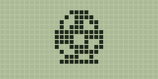<br>Ei | <br>Babytchi | 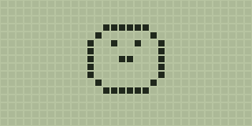<br>Marutchi | 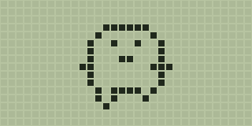<br>Tamatchi |
| 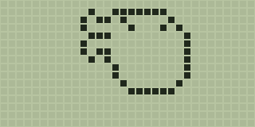<br>Kuchitamatchi | 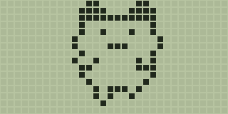<br>Mametchi | 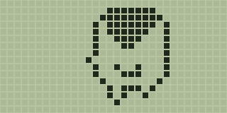<br>Ginjirotchi | 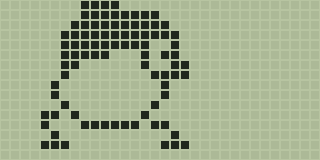<br>Maskutchi |
| 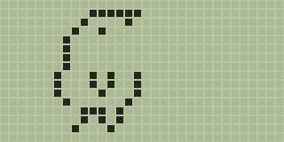<br>Kuchipatchi | 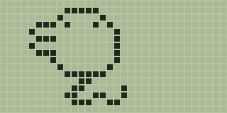<br>Nyorotchi | 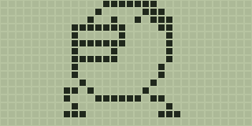<br>Tarakotchi | 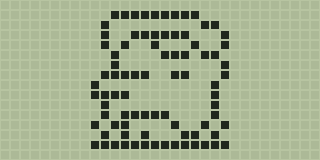<br>Oyajitchi |

## RAM-Adressen

Jede Adresse hält 4 Bit. Alles durch Beobachten und gezieltes Setzen im Emulator ermittelt.

| Adresse | Bedeutung |
|---|---|
| `0x10`/`0x11` | Uhr Sekunden (BCD, niedrig/hoch) |
| `0x12`/`0x13` | Uhr Minuten (BCD, niedrig/hoch) |
| `0x14`/`0x15` | Uhr Stunden (binär, `hoch*16+niedrig`); ein frisches Ei zeigt 32 = nicht gestellt |
| `0x2D` | 8, solange das Ruf-Icon leuchtet |
| `0x40` | Hunger 0–15, Herzen = `(Wert+1)//4`, Mahlzeit +4, fällt in Schritten von 4 |
| `0x41` | Glück 0–15, Herzen = `(Wert+1)//4`, Snack oder gewonnenes Spiel +4 |
| `0x42` | Pflegefehler 0–15 |
| `0x43` | Disziplin-Anzeige, +4 pro Schimpfen bei einem Schimpf-Ruf; bei jeder Verwandlung neu gesetzt |
| `0x46`/`0x47` | Gewicht (BCD) |
| `0x49` | wird 1, wenn das Tier krank war, bei der Verwandlung wieder 0 (nicht weiter geprüft) |
| `0x4B` | Licht: 15 an, 0 aus |
| `0x4D` | Anzahl Häufchen |
| `0x50` | Unterart: 1 Kind; Tamatchi 2 oder 3; Kuchitamatchi 4 oder 5; Erwachsene 15, nur der Maskutchi, der Oyajitchi wird, hat 6 |
| `0x51` | verpasste Schimpf-Rufe 0–15 |
| `0x54` | zählt bei jedem Aufwachen hoch (vermutlich das Alter, nicht geprüft) |
| `0x5D` | Charakter: 0 Ei oder tot, 1 Babytchi, 2 Marutchi, 3 Tamatchi, 4 Kuchitamatchi, 5 Mametchi, 6 Ginjirotchi, 7 Maskutchi, 8 Kuchipatchi, 9 Nyorotchi, 10 Tarakotchi, 11 Oyajitchi |
| `0x84` | im Spiel: ungleich 0, wenn die kommende Runde gewonnen wird (steht vor dem Tastendruck fest) |

## Weitere Beobachtungen

- Im Baby-Alter (65 Minuten) wird nichts gezählt.
- Schimpfen ohne Schimpf-Ruf bewirkt nichts.
- Im Spiel „links oder rechts“ steht das Ergebnis jeder Runde fest, bevor man drückt. Welche
  Taste man wann drückt, ist egal.
- Ein Ei schlüpft erst, nachdem die Uhr gestellt wurde.
- Lebensdauer bei guter Pflege, je ein Lauf im Zeitraffer, in Tagen seit dem Schlüpfen:
  Oyajitchi 24, Mametchi 20, Ginjirotchi 16, Maskutchi 16, Kuchipatchi 8, Tarakotchi 7,
  Nyorotchi 5.

## Aufbau

```
src/tamalib/     TamaLIB, unverändert bis auf eine Zeile in cpu.c (i = 0xFF in cpu_step)
src/tama_core.c  C-Hülle: ROM laden, Ticks laufen lassen, LCD/Ton/RAM auslesen, Zustand sichern
tama.py          ctypes-Anbindung
carebot.py       der Care-Bot
growth.py        Wachstumsregeln und Planung für ein Ziel (P1, P2)
growth_angel.py  dasselbe für den Angel
models.py        die bekannten ROMs und worin sie sich unterscheiden
report.py        Tagesbericht per E-Mail
engine.py        ein Tier: Emulator-Schleife und Care-Bot, als eigener Prozess
server.py        HTTP-Server, startet je Tier einen Prozess
web/             Oberfläche, die Unterseite /bot und die Optionen /settings
lab/             die Experimente, aus denen die Tabellen stammen
```

## Lizenz

GPL-2.0, wie TamaLIB (siehe `LICENSE`). Das Spiel-Icon ist „arrow-left-right“ aus
[coolicons](https://github.com/krystonschwarze/coolicons) von Kryston Schwarze (CC BY 4.0). Das
Favicon ist das Icon
[„Tamagotchi“, erstellt von Magnific – Flaticon](https://www.flaticon.com/de/kostenloses-icon/tamagotchi_743850);
es steht unter der Flaticon-Lizenz und nicht unter der GPL. Tamagotchi ist eine Marke von Bandai;
dieses Projekt hat mit Bandai nichts zu tun.
